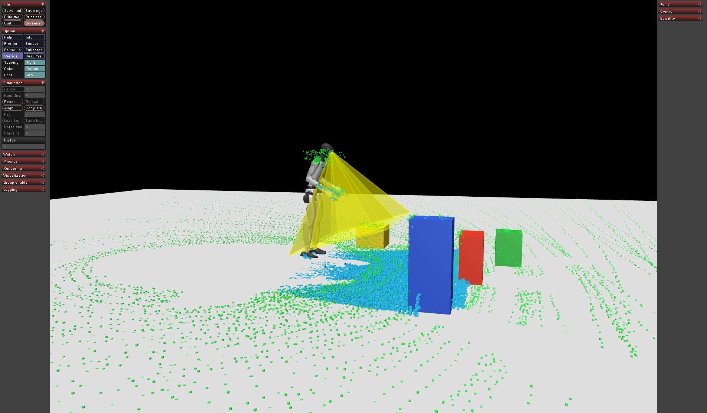

# g1-simulacrum

Sensorized Unitree G1 in MuJoCo: 29-DoF EDU body, Dex3-1 hands by default
(controller later), Livox Mid-360, RealSense D435i, pelvis and torso IMUs,
500 Hz PD or torque loop.

The public import is `g1_simulacrum`; the distribution name is `g1-simulacrum`.

- Design decisions: [`ARCHITECTURE.md`](ARCHITECTURE.md) (normative).
- Compiled hardware facts and citations: [`wiki/`](wiki/README.md).
- Runtime is Docker, not a host venv: [`docs/docker_usage.md`](docs/docker_usage.md).

```bash
cd docker
./run.sh up --build
./run.sh python -c "import g1_simulacrum; print(g1_simulacrum.__version__)"
./run.sh python -m pytest tests -q
```

```python
from g1_simulacrum import G1Simulacrum

sim = G1Simulacrum.from_config("configs/default.yaml")
sim.build()
obs = sim.reset()
obs = sim.step(obs.joint_state.position)  # (29,) body targets; None holds last
```

## Inspect viewer



GLFW on the host X display. From `docker/`:

```bash
./run.sh python examples/01_empty_arena.py
```

Green overlays are Mid-360, cyan is D435i depth. Default scene is
`g1_inspect.xml` (floor + boxes). `--empty` is floor only.

| Key / flag | Effect |
|------------|--------|
| **C** | Cycle free camera → `d435i_rgb` → `d435i_depth` (viewpoint; depth is the PiP) |
| **Numpad 8 / 2 / 4 / 6** | Crane trolley XY in current heading |
| **Numpad 7 / 9** | Change heading lock ±5° (torso stays facing that yaw) |
| **Numpad + / − / 5** | Shorten cable / lengthen (lower) / toggle crane |
| `--spawn X Y Z` | Spawn and gantry start (metres) |
| `--yaw DEG` | Heading about +Z (0 faces +X) |
| `--no-gantry` | No crane; PD only (floating base falls) |
| `--overlay sparse\|dense\|full` | Overlay density (default dense) |
| `--headless` | 50 control steps, no window |

The crane is a Unitree-style overhead cable on `torso_link` (hook at
`z = 2`) plus a GEAR-SONIC heading lock. Body PD stays on and holds the
spawn pose. Bottom-right PiP is colorized D435i depth (0.3–3 m); **C**
only changes the 3D viewpoint. Overlay dots are cheap boxes, refreshed
at sensor rate.
